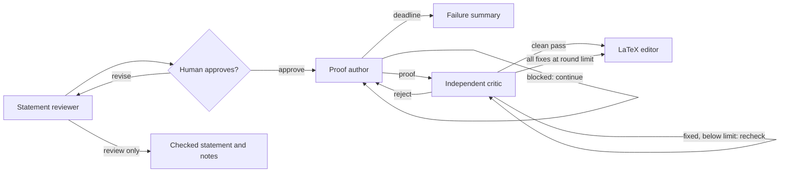

# TCS Prover

A local web UI that turns a theoretical-computer-science statement into a
persistent Codex proof search, independently audits and repairs the candidate,
then produces clean LaTeX. Algorithmic tasks can be entered as statements too.


## Install and run

Requires Python 3.9+, and a Codex account with access to the models
configured in the UI. Please install Codex CLI through this [official website](https://learn.chatgpt.com/docs/codex/cli).

```bash
codex login
git clone https://github.com/yonggangjiang/tcs-prover.git
cd tcs-prover
python3 -m pip install -r requirements.txt
python3 web_ui.py
```

You can type your open problem into the text box and click “Check Statement.” The system will first revise the statement to remove ambiguities and handle corner cases, then ask you to approve or reject the revised version.

If you approve it, persistent reasoning will begin and continue until a solution
is found or the time limit is reached. The candidate passes through an
independent critic loop. Accepted proofs are then pruned into readable LaTeX.

Options for changing the default model, time limit, and other settings are under
**Advanced**. Astra (`gpt-6-astra`) is the default model for every node.

### Terminal runs from Markdown

On a server without a browser, put the complete statement in any UTF-8 Markdown
file. Paragraphs, quotes, mathematical backslashes, and line breaks can be
copied into the file without escaping. Then pass the file directly to
`web_ui.py`:

```bash
python3 web_ui.py statement.md
```

This sends the entire file directly to the proof author, exactly like enabling
**Skip statement review** in Statement mode. It does not start an HTTP server or
open a browser. With no command-line overrides, it uses the same defaults as the
web UI: 2 critic rounds, a 168-hour total workflow limit, Astra and Ultra for all proof
roles, the built-in role prompts, and Fast generation speed.

#### Optional settings

Put overrides after the file or folder. The requested single-dash spelling,
double-dash camelCase spelling, and conventional double-dash kebab-case spelling
are all accepted. For example:

```bash
python3 web_ui.py statement.md -criticRounds 6 -thinkingHours 36
python3 web_ui.py statement.md --author-model gpt-5.6-terra --speed-mode standard
```

| Option | Default | Meaning |
| --- | --- | --- |
| `-criticRounds N` | `2` | Accept after N consecutive critic rounds that fix all reported bugs, without another audit; `1` to `100`. A clean pass accepts immediately; rejection resets the count. |
| `-thinkingHours HOURS` | `168` | Total elapsed-workflow limit; greater than `0` and at most `168`. It interrupts an active author, but not an active critic or the final LaTeX editor. |
| `-authorModel MODEL` | `gpt-6-astra` | Author model: `gpt-6-astra`, `gpt-5.6-sol`, `gpt-5.6-terra`, or `gpt-5.6-luna`. |
| `-criticModel MODEL` | `gpt-6-astra` | Critic model; same choices as the author. |
| `-writerModel MODEL` | `gpt-6-astra` | LaTeX writer model; same choices as the author. |
| `-reasoningEffort LEVEL` | `ultra` | Fallback effort for all three roles: `low`, `medium`, `high`, `xhigh`, `max`, or `ultra`. |
| `-authorEffort LEVEL` | shared effort | Override only the author effort. |
| `-criticEffort LEVEL` | shared effort | Override only the critic effort. |
| `-writerEffort LEVEL` | shared effort | Override only the LaTeX writer effort. |
| `-speedMode MODE` | `fast` | `fast` for 1.5x generation or `standard` for normal speed. Fast uses credits at a higher rate. |
| `-authorPromptFile PATH` | built-in prompt | Load a UTF-8 author prompt; it must contain exactly one `[STATEMENT]`. |
| `-criticPromptFile PATH` | built-in prompt | Load a UTF-8 critic prompt. |
| `-finalPromptFile PATH` | built-in prompt | Load a UTF-8 LaTeX prompt. |

Prompt-file paths are resolved from the terminal's current working directory.
Run `python3 web_ui.py --help` to see every spelling and allowed value.

#### Parallel folder runs

Passing a folder starts an independent proof for every top-level `.md` file in
that folder:

```bash
python3 web_ui.py statements/
python3 web_ui.py statements/ -criticRounds 6 -authorEffort max
```

The lookup is case-insensitive (`.md` and `.MD` both work), deterministic, and
non-recursive. All matching files and shared settings are validated before any
job starts. The jobs then run concurrently, and every override applies to every
file. Be aware that a large folder can therefore use many simultaneous Codex
jobs and credits.

Terminal output is concise by default: it reports only the current workflow
step, diagnostics, errors, and the start/finish result for each input file.
Prompts, model events, reasoning summaries, tool activity, and proof bodies are
not printed. They remain available in each proof's complete `transcript.jsonl`
and other artifacts under its separate directory in `runs/`. Pass
`--verbose-events` to restore the full public JSONL event stream; folder events
then include an `inputFile` field. A failed job does not cancel its siblings.
The exit status is `0` when every proof succeeds, `1` for invalid input or any
failed proof, and `130` after Ctrl-C. Ctrl-C stops all active folder jobs and
their subprocess trees.

#### Read a transcript as a human narrative

`transcript.jsonl` is the complete machine-readable event log and is deliberately
verbose. The local browser viewer organizes workflow stages, public reasoning
summaries, model messages, subagent/tool activity, critic checks, and final or
failure results without app-server protocol noise:

```bash
python3 transcript/view_transcript.py runs/2026-08-03_16-20-24_example/
python3 transcript/view_transcript.py runs/2026-08-03_16-20-24_example/transcript.jsonl
python3 transcript/view_transcript.py                       # newest run
```

The UI provides stage and activity filters, full-text search, root-only and
compact views, expandable long entries, critic verdict cards, automatic
full-file loading with pause/resume, and live updates. It binds only to local
host and protects its local API with a random per-launch token.

For terminal or file output, use the text mode:

```bash
python3 transcript/view_transcript.py RUN --text
python3 transcript/view_transcript.py RUN --text --follow
python3 transcript/view_transcript.py RUN --output readable.txt
```

In text mode, prompt bodies are hidden by default because they are long; add
`--prompts` to show them. Use `--stage solve`, `--stage critic`, `--root-only`,
`--no-tools`, or `--max-text 0` to adjust the view. Run
`python3 transcript/view_transcript.py --help` for all options. Both views display the
public reasoning summaries retained by TCS Prover, not private chain-of-thought.
They read incrementally, so even very large transcripts do not need to fit in
memory.

Choose **Statement** to review or edit a rough problem before approval. Include
the computational model, problem description, and asymptotic goal in the
statement for algorithmic tasks. Choose **LaTeX polish** to edit an existing
theorem and proof using only the final LaTeX node.
**Advanced** controls each node's model, reasoning effort, prompt, workflow time
limit, and critic-round limit. Its **Statement review only** option runs just the
reviewer, saves the checked statement and reviewer notes, and finishes without
starting the proof author, critic, or LaTeX editor. This option and **Skip
statement review** are mutually exclusive. Jobs run in parallel. **Show
details** displays the exact application prompts and returned model text.
Private records and outputs are stored under `runs/`.

## Workflow



### 1. Statement reviewer

This node lets the user start with convenient informal language while preventing
a model from silently solving a different problem. To use it without requesting
a proof, open **Advanced**, enable **Statement review only**, and submit the
statement. The completed result remains available to copy from the review page
and is saved as `checked-statement.md` in that job's run directory. Only the
reviewer model, reviewer reasoning effort, reviewer prompt, and generation speed
apply in this mode.

For example, graph-algorithm papers commonly write a bound such as
`m log² n`. A literal model may object that `m` can be smaller than `n` and call
the target impossible. The review step states the intended convention and writes
it as `(m+n) log² n` instead of letting that mismatch
derail the proof search.

### 2. Proof author

The author uses the durable-state, multi-agent prompt adapted from OpenAI's
[Cycle Double Cover prompt](https://cdn.openai.com/pdf/04d1d1e4-bc75-476a-97cf-49055cd98d31/cdc_prompt.pdf).

The author keeps the Goal active: a blocked or prematurely ended author turn is
continued until it returns a solution or reaches the user-set total elapsed-time
limit. The web limit uses the same clock displayed at the top of the page, so
statement review and approval time count too. If the limit expires during a
critic round, that critic work continues; an accepted proof proceeds to LaTeX,
while a rejection goes to the failure-summary node instead of starting another
author revision.

Each proof run also owns two private controller-written files in its `runs/...`
directory. `author-anchor.md` contains the exact original author prompt and
statement. `author-memory.json` is a bounded ledger of candidate fingerprints,
approach outcomes, blocked routes, critic feedback, and unresolved obligations.
Writes are atomic and best-effort private. The JSON file is capped at 64 KiB,
and the historical snapshot placed in a model request is independently capped
at 24 KiB; old records are folded into counters and a rolling digest.

The controller re-injects the immutable anchor and current memory after every
root-author context compaction, every explicit continuation, and every critic
rejection. A compaction re-anchor is steered into the same active turn; it does
not replace the author thread. Memory records repeated candidates but does not
skip calls, end the search, or otherwise alter the proof workflow.

### 3. Independent critic

The critic independently checks the author's proof and repairs every issue it
can. A clean pass accepts the proof immediately. If every reported bug is
fixable, the repaired proof goes to a fresh critic until the configured limit
is reached. After 2 consecutive such rounds by default, the latest repaired
proof is accepted without another check and sent to the LaTeX editor.

Unresolved bugs cause rejection: the author resumes its existing thread with
the critic's feedback, and the consecutive-round count resets. A rejection at
the round limit still returns to the author; it never counts as acceptance.

“Independent” here means fresh contexts and subagents. A human or different-family review remains advisable.

### 4. LaTeX editor

Correct-looking generated proofs are often repetitive, poorly ordered, or hard
to read. After critic acceptance, this node preserves the mathematics while
rewriting it as a compact, structured TCS-style LaTeX proof. It also runs
independently through **LaTeX polish**.
In practice this often makes the output substantially easier to read.

## Project structure

The root has two Python entry points. `workflow_runner.py` contains the entire
workflow engine, including Codex transport, persistent sessions, deadlines, and
durable memory. `web_ui.py` launches the UI or Markdown proof jobs. The
`workflows/` directory contains exactly two YAML definitions:

```text
workflow_runner.py          Complete workflow engine and workflow CLI
web_ui.py                   UI and Markdown-job launcher
workflows/
  author_critic.yaml         Author/critic prompts, response schema, and logic
  clean_up.yaml              LaTeX prompts, response schema, and logic
transcript/
  view_transcript.py         Transcript reader, CLI, and viewer server
  transcript_ui/            Transcript viewer HTML, JavaScript, and CSS
ui/
  server.py                 HTTP endpoints, job state, and process management
  review.py                 Independent statement-review procedure
  cli.py                    UI startup and Markdown file/folder runs
  index.html, app.js, styles.css
docs/workflows.md           Workflow authoring guide and full YAML reference
tests/                      Offline regression tests
```

The UI starts the root workflow runner in each job's private workspace and
passes it the appropriate YAML files. Statement review remains independent of
the workflow graphs. UI and Markdown-job artifacts still live under the
repository's `runs/` folder, regardless of the launcher's working directory.

## Workflow files and executor

Each YAML file contains `nodes` and `prompts`. Node names are arbitrary; the
first node is the entry point. `run: structured` makes a model call with a
response shape, while `run: goal` starts or resumes a persistent task. The YAML
defines inputs, result checks, state updates, and transitions, including the
critic's repeat limit.

A complete custom workflow can be as small as this `summarize.yaml`:

```yaml
nodes:
  summarize:
    run: structured
    prompt: summarize
    inputs:
      content: state.input
    response:
      summary: string
    after:
      - set: {output: result.summary}
    next: end
prompts:
  summarize: "Summarize this text in one sentence: {content}"
```

```bash
python3 workflow_runner.py summarize.yaml < notes.md
```

The [workflow authoring guide](docs/workflows.md) explains every YAML entry,
response shorthand and full schemas, branching and repeat limits, expressions,
persistent-session prompts, model overrides, and offline validation. It includes
a complete editing workflow with decisions and a configurable repeat limit.
Keep custom definitions outside the bundled `workflows/` directory.

Run the graphs directly with UTF-8 input on standard input:

```bash
python3 workflow_runner.py workflows/author_critic.yaml workflows/clean_up.yaml < statement.md
python3 workflow_runner.py workflows/clean_up.yaml < theorem-and-proof.md
```

The first command runs proof search, criticism, and LaTeX cleanup; the second
runs cleanup alone. Both skip statement review. Use
`python3 workflow_runner.py --help` for model, reasoning, time-limit, critic-round,
and prompt overrides. `--model` sets the fallback model for any workflow;
`--set NAME=VALUE` supplies arbitrary named options and accepts JSON values.
Node `role` settings can use options such as `editor_model` and `editor_effort`.

The CLI initializes `state.input`, `state.statement`, and `state.source` with the
same input after trimming surrounding whitespace. Chained graphs share state,
and `state.failed` stops the chain. Output is JSONL events, ending with
`workflow_result` on success and its
`output` field from `state.output`. The Python API is
`execute(path, state, options=...)` or `execute_workflows(paths, state, options)`.
All graphs are validated before a chain starts. `requirements.txt` installs
PyYAML for loading definitions and jsonschema for checking response schemas.

Run the regression suite without making model calls:

```bash
python3 -m unittest discover -s tests -v
```
