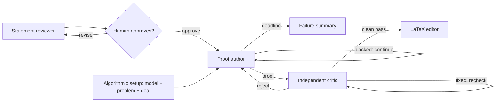

# TCS Prover

A local web UI that turns either an informal theoretical-computer-science
statement or a structured algorithmic problem into a persistent Codex proof
search, independently audits and repairs the candidate, then produces clean
LaTeX.

Compared with more complex harnesses such as [ProofCouncil](https://arxiv.org/pdf/2607.09474) and [Danus](https://arxiv.org/pdf/2607.06447), TCS Prover is designed to be lightweight, cost-friendly, and tailored to GPT-5.6 and theoretical computer science. Every component in its workflow has a specific, evidence-supported purpose. New components are welcome, but should be justified by evidence to avoid unnecessary heuristic complexity and cost. Suggestions and feedback are encouraged—please contact the project maintainer.

## Install and run

Requires Python 3.9+, Node.js/npm, and a Codex account with access to the models
configured in the UI.

```bash
npm install -g @openai/codex
codex login
git clone https://github.com/yonggangjiang/tcs-prover.git
cd tcs-prover
python3 web_ui.py
```

On macOS, `Start TCS Prover.command` is an alternative launcher. Codex can use
an eligible ChatGPT plan; see OpenAI's
[Codex CLI guide](https://help.openai.com/en/articles/11096431) and
[ChatGPT-plan guide](https://help.openai.com/en/articles/11369540).
Every model call forces Codex Fast mode (1.5× speed), which uses more credits.

Choose **Statement** to review or edit a rough problem before approval. Choose
**Algorithmic** to specify the model of computation, problem description, and
asymptotic upper- or lower-bound goal; these fields go directly to the proof
author without a statement-review step.
**Advanced** controls each node's model, reasoning effort, prompt, author time
limit, and critic-round limit. Jobs run in parallel. **Show details** displays
the exact application prompts and returned model text. Private records and
outputs are stored under `runs/`.

## Workflow



### 1. Statement reviewer

This node lets the user start with convenient informal language while preventing
a model from silently solving a different problem. 

For example, graph-algorithm papers commonly write a bound such as
`m log² n`. A literal model may object that `m` can be smaller than `n` and call
the target impossible. The review step states the intended convention and write it as `(m+n) log² n`instead of letting that mismatch
derail the proof search.

### Algorithmic mode

This mode skips the statement reviewer. The server trims and combines the three
required fields under explicit `MODEL OF COMPUTATION`, `PROBLEM DESCRIPTION`,
and `GOAL (ASYMPTOTIC UPPER OR LOWER BOUND)` headings, saves both the source
fields and the combined task in the run folder, and sends that exact task through
the normal proof-author pipeline.

The model and problem fields also show reusable presets loaded from
`algorithmic/model.json` and `algorithmic/problem.json`. Each catalog entry has
only a `name` and `description`; selecting its name copies the description into
the corresponding field. Restart the local server after editing a catalog.

### 2. Proof author

The author uses the durable-state, multi-agent prompt adapted from
[Chao Xu's “AI Agents for the Working Mathematician”](https://chaoxu.prof/posts/2026-07-18-ai-agents-for-the-working-mathematician.html).
Thanks to Chao Xu for publishing it. His prompt in turn credits OpenAI's
[Cycle Double Cover prompt](https://cdn.openai.com/pdf/04d1d1e4-bc75-476a-97cf-49055cd98d31/cdc_prompt.pdf)
and [Danus](https://github.com/frenzymath/Danus).

There is not yet controlled evidence that this prompt is better than the CDC
prompt. However, there are several personal cases where a carefully crafted prompt run succeeded after
one-shot ChatGPT attempts did not, so at least it is better than nothing.

The author keeps the Goal active: a blocked or prematurely ended author turn is
continued until it returns a solution or reaches the user-set time limit.

### 3. Independent critic

Although in the author prompt there are already instructions on indepent audit checking, there are cases where these instructions do not guarantee that the resulting proof
survives a fresh check. The critic therefore do the job again and repairs every issue it can, sends repaired mathematics to another
fresh critic. Unresolved bugs go back to the author. Only a clean pass exits the
loop. This catches both structural gaps and also fixable bugs.

“Independent” here means fresh contexts and subagents. A human or different-family review remains advisable.

### 4. LaTeX editor

Correct-looking generated proofs are often repetitive, poorly ordered, or hard
to read. After—and only after—a clean critic pass, this node preserves the
mathematics while rewriting it as a compact, structured TCS-style LaTeX proof.
In practice this often makes the output substantially easier to read.
