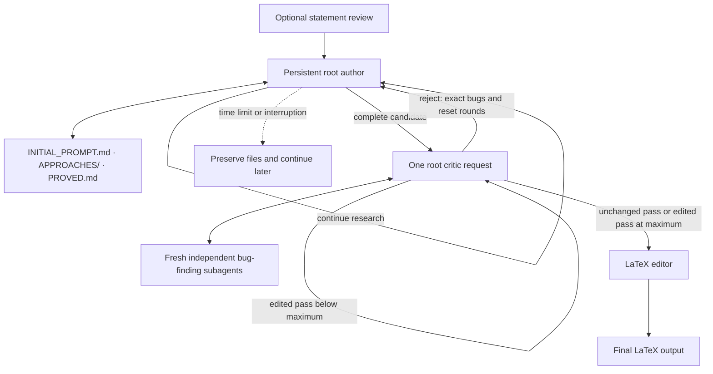

# TCS Prover

A local web UI that gives a persistent root author LLM a mathematical statement,
lets it explore diverse approaches with independent subagents while maintaining
a readable research journal, checks its candidate through a critic loop, and
produces a complete LaTeX document.
Algorithmic tasks can be entered as statements too.

The complete author instructions live directly in
[`workflows/author_critic.yaml`](workflows/author_critic.yaml). The LLM creates,
reads, searches, and updates its initial instructions, approach files, and proved
lemmas under that prompt.

The Codex CLI provides the local author session and model-call runtime. The
author keeps the same conversation while it works; files preserve its assignment,
attempt history, and proved results across interruptions or context compaction.
Astra with Ultra reasoning and Fast generation are the defaults for every
role. DeepSeek V4 Pro is an additional
model option that uses the same harness pipeline through DeepSeek's official
API.


## Install and run

Requires Python 3.9+ and the Codex CLI. Install Codex CLI through this
[official website](https://learn.chatgpt.com/docs/codex/cli).

```bash
codex login
git clone https://github.com/yonggangjiang/tcs-prover.git
cd tcs-prover
python3 -m pip install -r requirements.txt
python3 web_ui.py
```

The Web UI opens locally with Astra, Ultra, and Fast defaults for
the reviewer, proof author, critic, and LaTeX writer. The DeepSeek setup below
is needed only when you select DeepSeek for one or more roles.

## How to use DeepSeek

### 1. Obtain an official API key

Create a key in your DeepSeek account. TCS Prover uses only
`DEEPSEEK_API_KEY`; the key must belong to the official DeepSeek API account
that will be billed for the model calls.

### 2. Make the key available to TCS Prover

In the same Terminal window where you will start the Web UI, run:

```bash
export DEEPSEEK_API_KEY="sk-..."
```

This lasts for the lifetime of that shell. Editing or updating TCS Prover does
not erase the variable, so restarting from the same Terminal does not require
another `export`. A newly opened Terminal does require it unless you add the
same export to your shell startup configuration.

To check the variable without printing the secret:

```bash
python3 -c 'import os; print("DeepSeek key is set" if os.environ.get("DEEPSEEK_API_KEY") else "DeepSeek key is missing")'
```

### 3. Start the Web UI

From the repository directory:

```bash
python3 web_ui.py
```

Open **Advanced**, then select **DeepSeek V4 Pro — Official API** for any roles
you want DeepSeek to handle. Selecting it for all four model roles means that
the statement reviewer, author, critic, and LaTeX writer all use DeepSeek.
A Codex/ChatGPT login is not required for roles that use DeepSeek.

DeepSeek exposes `high` and `max` reasoning in this harness. The shared menu is
normalized as follows: `low`, `medium`, and `high` run as DeepSeek `high`;
`xhigh`, `max`, and `ultra` run as DeepSeek `max`. DeepSeek always uses Standard
speed because the Fast service tier is specific to OpenAI models.

The harness passes the selected key through environment-backed authentication
to each relevant child process, injects an isolated
Responses-provider configuration, and loads model metadata based on DeepSeek's
[official Codex integration](https://api-docs.deepseek.com/quick_start/agent_integrations/codex/).
It does not put the key in process arguments, edit `~/.codex/config.toml`, send
the key through the UI, or save it in run artifacts.

If the UI reports that `DEEPSEEK_API_KEY` is missing, stop the Web UI, export
the key in the Terminal that will launch it, and start it again. If DeepSeek
returns an authentication error, verify that this is an active official API
key and that no extra quotation marks were copied into its value.

You can type your open problem into the text box and click “Check Statement.” The system will first revise the statement to remove ambiguities and handle corner cases, then ask you to approve or reject the revised version.

If you approve it, persistent reasoning will begin and continue until a solution
is found or the time limit is reached. The candidate passes through an
independent critic loop. Accepted proofs are then formatted as readable LaTeX.

Options for changing the default model, time limit, and other settings are under
**Advanced**. Astra (`gpt-6-astra`) is the default model for every node.

## Terminal runs from Markdown

On a server without a browser, put the complete statement in any UTF-8 Markdown
file. Paragraphs, quotes, mathematical backslashes, and line breaks can be
copied into the file without escaping. Then pass the file directly to
`web_ui.py`:

```bash
python3 web_ui.py statement.md
```

This sends the entire file directly to the proof author, exactly like enabling
**Skip statement review** in Statement mode. It does not start an HTTP server or
open a browser. With no command-line overrides, it uses the same defaults as the
web UI: a maximum of 2 consecutive edited critic passes, a 168-hour total workflow
limit, Astra and Ultra for all proof
roles, the built-in role prompts, and Fast generation speed. The
activity log requests concise public reasoning summaries by default.

### Optional settings

Put overrides after the file or folder. The requested single-dash spelling,
double-dash camelCase spelling, and conventional double-dash kebab-case spelling
are all accepted. For example:

```bash
python3 web_ui.py statement.md -criticRounds 6 -thinkingHours 36
python3 web_ui.py statement.md --author-model gpt-5.6-terra --speed-mode standard
```

| Option | Default | Meaning |
| --- | --- | --- |
| `-criticRounds N` | `2` | Maximum consecutive edited critic passes before using the latest solution; `1` to `100`. An unchanged pass accepts immediately. Rejection returns to the author and resets the count. |
| `-thinkingHours HOURS` | `168` | Total elapsed-workflow limit; greater than `0` and at most `168`. Bounds author, critic, and final model calls. Recorded work is retained when time runs out. |
| `-authorModel MODEL` | `gpt-6-astra` | Author model: `gpt-6-astra`, `gpt-5.6-sol`, `gpt-5.6-terra`, `gpt-5.6-luna`, or official `deepseek-v4-pro`. |
| `-criticModel MODEL` | `gpt-6-astra` | Critic model; same choices as the author. |
| `-writerModel MODEL` | `gpt-6-astra` | LaTeX writer model; same choices as the author. |
| `-reasoningEffort LEVEL` | `ultra` | Fallback effort for all three roles: `low`, `medium`, `high`, `xhigh`, `max`, or `ultra`. |
| `-authorEffort LEVEL` | shared effort | Override only the author effort. |
| `-criticEffort LEVEL` | shared effort | Override only the critic effort. |
| `-writerEffort LEVEL` | shared effort | Override only the LaTeX writer effort. |
| `-speedMode MODE` | `fast` | `standard` for normal speed or `fast` for ChatGPT's accelerated generation. DeepSeek calls always use standard service because Fast is provider-specific. |
| `-reasoningSummary LEVEL` | `concise` | Public activity-log summaries: `none`, `concise`, or `detailed`. This never exposes private chain-of-thought. |
| `-authorPromptFile PATH` | built-in prompt | Load a UTF-8 author prompt; it must contain exactly one `[STATEMENT]`. |
| `-criticPromptFile PATH` | built-in prompt | Load a UTF-8 critic prompt. |
| `-finalPromptFile PATH` | built-in prompt | Load a UTF-8 LaTeX prompt. |

Prompt-file paths are resolved from the terminal's current working directory.
Run `python3 web_ui.py --help` to see every spelling and allowed value.

## How to use checkpoints

TCS Prover writes durable artifacts while a job progresses. When the Web UI is
started again, it scans `runs/*/transcript.jsonl`, restores the historical job
cards, and lists every resumable critic checkpoint found in those run folders.
You do not need to keep the old browser tab open.

A saved proof candidate contains the checked statement and latest complete
argument. Continuing it starts a fresh root critic request from that candidate.
Within the request, the critic uses its own fresh independent subagents to
find bugs and then repairs the argument itself.

To continue from the Web UI:

1. Stop the old server if it is still running, then run `python3 web_ui.py`.
2. On the home screen, locate the historical job by its full start/finish time.
3. Click the continuation button beside the checkpoint you want.
4. Confirm the action. TCS Prover creates a new job and opens it immediately.

Saved run inputs and transcripts are preserved. The new job copies the selected candidate,
role prompts, model choices, reasoning efforts, speed, critic-round maximum,
and workflow time limit. Old saved model routes that are no longer selectable
are migrated to the official DeepSeek model when the
job is restored.

Very old runs that predate `job-settings.json` can restore only choices visible
in their transcript. A role that never ran has
no recorded model choice and therefore uses the current default when resumed.
The continuation confirmation names these unknown legacy roles before a new
paid request starts.

A checkpoint exists only after a complete artifact has been written. It cannot
restore the middle of an in-flight model response or its private reasoning. If
a process stops between two checkpoints, continuation begins from the most
recent checkpoint listed on the job card.

### Continue a manually stopped job

Jobs stopped with the Web UI's **Stop** button remain visible as **Stopped at
review**, **solve**, **repair**, **critic**, **final**, or **failure** after the
server is restarted. On the home page, use the stage-specific continuation
button:

| Stopped stage | Button | Continuation boundary |
| --- | --- | --- |
| Statement review | **Retry statement review** | Starts a new review request from `review-input.json`, including the current statement and feedback, plus the saved prompt and role settings. Older runs without this artifact warn that only their original draft and no feedback can be recovered. |
| Proof author, repair, or interrupted failure summary | **Continue proof author** | Uses `INITIAL_PROMPT.md`, the approach index and route files, and `PROVED.md`, plus saved user instructions. It resumes the author conversation when available; otherwise a new conversation reads the active work before continuing. Unmigrated older runs retain their `APPROACHES.md` layout. Visible partial text is not treated as a complete proof. |
| Critic | **Continue critic** | Starts a fresh critic round from the latest saved candidate. The critic requests new independent bug-finding reports. |
| LaTeX editor | **Retry LaTeX editor** | Retries the single editor call with the saved accepted solution or standalone LaTeX source. Older jobs without an exact final input fall back to their latest critic checkpoint. |

These continuation actions create a new run folder while preserving the source
job's saved inputs and transcripts. Author continuation updates the existing shared
research records. An in-flight request or inaccessible private reasoning cannot be
recovered as a completed answer. Review and final requests retry from their
exact saved public input. The author resumes its existing conversation when
available, or reads its research records in a fresh conversation. Historical runs created before
`manual-stop.json` are recognized from their existing `Stop requested`
transcript entry.

### Command-line fallback

Continue a stopped author with its saved notebooks and a new time budget:

```bash
python3 web_ui.py --resume-research runs/YOUR_PREVIOUS_RUN
python3 web_ui.py --resume-research runs/YOUR_PREVIOUS_RUN --thinking-hours 24
```

This opens a continued browser-visible job while preserving the source job's
saved inputs and transcripts. The author updates its existing research workspace;
saved settings remain in
effect unless explicitly overridden. The full initial assignment is preserved
rather than reconstructed from a short summary. Critic and finalization
checkpoints retain their separate review artifacts.

If a run contains `SOLUTION.md` or `saved-candidate.md` but no checkpoint button
is available, open a new critic job explicitly:

```bash
python3 web_ui.py --resume-critic runs/2026-08-26_16-33-26_example
```

This loads the saved complete proof, checked statement, and role prompts into
a new browser-visible job. An unchanged pass advances to the LaTeX editor;
edited passes repeat until the configured maximum, then use the latest solution.
A critic rejection returns the exact candidate
and bug report to the normal proof-author repair loop; the harness workflow is
not shortened or replaced.

## Parallel folder runs

Passing a folder starts an independent proof for every top-level `.md` file in
that folder:

```bash
python3 web_ui.py statements/
python3 web_ui.py statements/ -criticRounds 6 -authorEffort max
```

The lookup is case-insensitive (`.md` and `.MD` both work), deterministic, and
non-recursive. All matching files and shared settings are validated before any
job starts. The jobs then run concurrently, and every override applies to every
file. Be aware that a large folder can therefore use many simultaneous Codex
jobs and credits.

Terminal output is concise by default: it reports only the current workflow
step, diagnostics, errors, and the start/finish result for each input file.
Prompts, model events, reasoning summaries, tool activity, and proof bodies are
not printed. They remain available in each proof's complete `transcript.jsonl`
and other artifacts under its separate directory in `runs/`. Pass
`--verbose-events` to restore the full public JSONL event stream; folder events
then include an `inputFile` field. A failed job does not cancel its siblings.
The exit status is `0` when every proof succeeds, `1` for invalid input or any
failed proof, and `130` after Ctrl-C. Ctrl-C stops all active folder jobs and
their subprocess trees.

## Read a transcript as a human narrative

`transcript.jsonl` is the complete machine-readable event log and is deliberately
verbose. The local browser viewer organizes workflow stages, public reasoning
summaries, model messages, subagent/tool activity, critic checks, and final or
failure results without app-server protocol noise:

```bash
python3 transcript/view_transcript.py runs/2026-08-03_16-20-24_example/
python3 transcript/view_transcript.py runs/2026-08-03_16-20-24_example/transcript.jsonl
python3 transcript/view_transcript.py                       # newest run
```

The UI provides stage and activity filters, full-text search, root-only and
compact views, expandable long entries, critic verdict cards, automatic
full-file loading with pause/resume, and live updates. It binds only to local
host and protects its local API with a random per-launch token.

For terminal or file output, use the text mode:

```bash
python3 transcript/view_transcript.py RUN --text
python3 transcript/view_transcript.py RUN --text --follow
python3 transcript/view_transcript.py RUN --output readable.txt
```

In text mode, prompt bodies are hidden by default because they are long; add
`--prompts` to show them. Use `--stage solve`, `--stage critic`, `--root-only`,
`--no-tools`, or `--max-text 0` to adjust the view. Run
`python3 transcript/view_transcript.py --help` for all options. Both views display the
public reasoning summaries retained by TCS Prover, not private chain-of-thought.
They read incrementally, so even very large transcripts do not need to fit in
memory.

Choose **Statement** to review or edit a rough problem before approval. Include
the computational model, problem description, and asymptotic goal in the
statement for algorithmic tasks. Choose **LaTeX polish** to edit an existing
theorem and proof with a single editor call.
**Advanced** controls each node's model, reasoning effort, prompt, public activity-log
detail, workflow time limit, and critic-round limit. The log can show status
only or request concise or detailed model-generated summaries. Its **Statement review only** option runs just the
reviewer, saves the checked statement and reviewer notes, and finishes without
starting the proof author, critic, or LaTeX editor. This option and **Skip
statement review** are mutually exclusive. Jobs run in parallel. **Show
details** displays the exact application prompts and returned model text.
Private records and outputs are stored under `runs/`.

New jobs read the author and critic prompts from `workflows/author_critic.yaml`
and the final editor prompt from `workflows/clean_up.yaml` at launch. YAML edits
take effect without restarting the server, even if the browser page was already
open. The prompt editor refreshes these defaults when opened. **Apply to this
job** changes only that job; prompts are never remembered in browser storage or
carried into the next new job. Continuing an existing job preserves its saved
prompt and research workspace. Use a new job for a changed author policy, or
explicitly approve a history-preserving migration of the existing instructions
and research records.

Every job card shows its full local start and finish date and time, including
seconds. Active jobs show that they have not finished yet, so repeated problem
titles remain distinguishable.

While a proof author or author repair is running, **Guide the running proof
author** sends a live instruction into the running author session. It does not
discard the memory files or restart the problem. The
control is intentionally unavailable during statement review,
critic review, failure summaries, and final LaTeX editing.

**Pause**, beside **Stop**, interrupts the active Codex turn and pauses its goal,
preserving the native conversation and existing research files. It does not ask
the model to produce a final answer or spend another turn writing a summary.
Wait for **Paused** before closing the UI or changing your Codex CLI login. Then
click **Resume** on the inference page or job card: a fresh CLI process reopens
the same saved thread in the same run folder and appends to its transcript.
If that saved thread cannot be reopened, the job remains paused with an error
and can be retried; it does not silently replace the conversation. A pause before
Codex created any thread starts that initial thread on Resume.
Paused jobs also remain resumable after restarting the UI. Paused time does not
consume the remaining workflow time budget. Already saved conversation and file
content are retained; an interrupted response or file write may be incomplete.
Usage limits, network failures, and unexpected author interruptions also pause
the job automatically, displaying the reason and keeping Resume available in
the same folder. Resolve the interruption, then click Resume when ready.
For a reached workflow time limit, increase the existing total time limit control
while paused before clicking Resume.
**Stop** keeps its existing immediate termination behavior.

When LaTeX editing finishes, **Download .tex** downloads that job's saved
`final.tex`. There is no PDF generation or PDF download.

Live web search is enabled for the author, statement reviewer, critic, and
LaTeX editor, including structured retries and the configuration inherited by
subagents. The runner explicitly sets Codex's
[`web_search="live"`](https://learn.chatgpt.com/docs/config-file/config-reference)
for new and resumed sessions; the models decide when to search.

## Workflow



### 1. Statement reviewer

This node lets the user start with convenient informal language while preventing
a model from silently solving a different problem. To use it without requesting
a proof, open **Advanced**, enable **Statement review only**, and submit the
statement. The completed result remains available to copy from the review page
and is saved as `checked-statement.md` in that job's run directory. Only the
reviewer model, reviewer reasoning effort, reviewer prompt, and generation speed
apply in this mode.

For example, graph-algorithm papers commonly write a bound such as
`m log² n`. A literal model may object that `m` can be smaller than `n` and call
the target impossible. The review step states the intended convention and writes
it as `(m+n) log² n` instead of letting that mismatch
derail the proof search.

### 2. One persistent author and an indexed research journal

The default author has one persistent root goal and enables `multi_agent`.
Its prompt calls for deep investigation of one principal route, with independent
subagents applying different methods to its unresolved steps. They work without
communicating with one another and report to the root author, which also does
mathematical work and records the results. Difficulty or completion of a helper
lemma does not automatically trigger another brainstorming round. The separate
critic checks any completed candidate afterward.

The author maintains three research locations in its run folder:

| File | Contents |
| --- | --- |
| `INITIAL_PROMPT.md` | The complete original author prompt, including the exact statement and search strategy. The author creates it if absent and is instructed to preserve it unchanged. |
| `APPROACHES/` | `INDEX.md` identifies the principal route, links every approach, and records its status and obstacle or result. Each `A001-short-title.md` route file starts with its current position and next action, followed by dated, detailed research entries. |
| `PROVED.md` | Only fully justified positive or negative lemmas, with exact assumptions, complete arguments, and links to their originating approach IDs. |

The model creates and maintains these records itself. Route statuses are
**ACTIVE**, **PARKED** (unresolved, with a re-entry action), **CLOSED** (a scoped
failed claim or construction), and **RESOLVED** (the stated subproblem is solved).
The index is navigation, not a substitute for reading the active argument and
its supporting lemmas. The optional **Research memory** browser panel shows the
index and lets you select a route; legacy notebooks remain readable.

Each route retains constructions, calculations, attempted proofs, examples,
counterexamples, repairs, and substantive subagent findings with their full
arguments and explicit gaps, rather than conclusions alone. Corrections are
appended while the current-position summary stays up to date. Before switching,
the author records what it tried, why the obstacle remains, how to resume, and
why the alternative deserves priority. New lemmas must be applied to the current
candidate, with the remaining task-level obligations made explicit. There are
no added model roles, routine lemma-audit loops, or token/word quotas.

Unfinished arguments and suspected counterexamples remain in the approach files;
only completely proved results belong in `PROVED.md`. A failed variant does not
close an entire research family. Renaming a failed construction is not a new idea.

While the process runs, the author continues in the same conversation. On
context compaction or continuation it reads the initial assignment, index, active
route's current position and relevant entries, and supporting lemmas. It resumes
the recorded next action. After an interruption it resumes that conversation
when available; otherwise it reads the same records in a fresh conversation. The
resume prompt includes the original full assignment as a fallback when the
initial prompt file is absent. File creation, reading, and updating belong to
the LLM; the runner does not parse, summarize, or maintain a research database.
An older run's saved initial instructions retain its legacy layout unless the
user explicitly approves a migration. Such a migration preserves its original
chronological notebook and initial instructions as historical artifacts, and
identifies the new active layout explicitly in `INITIAL_PROMPT.md`.

This design depends on the author's adherence to the notebook and novelty
instructions. It makes its history readable and available; it does not
mechanically prove that two differently worded ideas are different or guarantee
that every unsuccessful internal thought was written down. Public transcripts,
critic checkpoints, and final documents remain separate operational artifacts.

The shared deadline still bounds author, critic, and final model calls. A
stopped author preserves its best recorded work and outstanding tasks rather
than claiming a solution. `--resume-research` is the continuation entry point
for the saved author notebook and conversation.

### 3. Critic loop

Each round is one root critic LLM request with `multi_agent` enabled. Its prompt
tells it to launch fresh independent subagents for aggressive bug finding:
mathematical errors, omitted details, undefined terms, and other gaps. They are
instructed not to communicate with one another and to report back to the critic.
The critic considers those reports and repairs the complete argument itself.

If it cannot fix every issue, it returns the latest safely repaired candidate
and exact unresolved bugs to the author. The author continues with the same
research records, records the objections, and rechecks affected lemmas. This
rejection resets the consecutive critic-round count.

An unchanged pass accepts immediately. An edited pass sends the latest solution
to another fresh critic round while below the configured maximum (default 2).
At that maximum, an edited pass accepts the latest solution and proceeds to
LaTeX formatting. The setting is a maximum for consecutive edited passes, not
a requirement to obtain a fixed number of passes. Model review is not formal
proof verification.

### 4. LaTeX editing

The editor makes one LLM call with the editing prompt and accepted solution,
or the supplied `.tex` contents in standalone mode. It returns a JSON object
whose `latex` field contains the complete document, which becomes the final
output. Compilability is a prompt requirement; the workflow does not run a
compiler or an additional final verifier.

## Project structure

The root has two Python entry points. `workflow_runner.py` provides the graph
engine and model/goal transport. The author research records remain plain
Markdown files managed by the LLM under the YAML prompt. `web_ui.py` launches the UI or Markdown proof jobs. The
`workflows/` directory contains exactly two YAML definitions:

```text
workflow_runner.py          Graph engine, model transport, and workflow CLI
web_ui.py                   UI and Markdown-job launcher
workflows/
  author_critic.yaml         Author/critic prompts, response schema, and logic
  clean_up.yaml              LaTeX prompts, response schema, and logic
transcript/
  view_transcript.py         Transcript reader, CLI, and viewer server
  transcript_ui/            Transcript viewer HTML, JavaScript, and CSS
ui/
  server.py                 HTTP endpoints, job state, and process management
  review.py                 Independent statement-review procedure
  cli.py                    UI startup and Markdown file/folder runs
  index.html, app.js, styles.css
tests/                      Offline regression tests
```

The UI starts the root workflow runner in each job's private workspace and
passes it the appropriate YAML files. Statement review remains independent of
the workflow graphs. UI and Markdown-job artifacts still live under the
repository's `runs/` folder, regardless of the launcher's working directory.

## Workflow files and executor

Each YAML file contains `nodes` and `prompts`. Node names are arbitrary; the
first node is the entry point. `run: structured` makes a model call with a
response shape, while `run: goal` starts or resumes the persistent author
conversation. Memory-file instructions are plain prompt text. The YAML defines inputs, result checks, state updates, and transitions, including the
critic's repeat limit.

A complete custom workflow can be as small as this `summarize.yaml`:

```yaml
nodes:
  summarize:
    run: structured
    prompt: summarize
    inputs:
      content: state.input
    response:
      summary: string
    after:
      - set: {output: result.summary}
    next: end
prompts:
  summarize: "Summarize this text in one sentence: {content}"
```

```bash
python3 workflow_runner.py summarize.yaml < notes.md
```

Keep custom definitions outside the bundled `workflows/` directory.

Run the graphs directly with UTF-8 input on standard input:

```bash
python3 workflow_runner.py workflows/author_critic.yaml workflows/clean_up.yaml < statement.md
python3 workflow_runner.py workflows/clean_up.yaml < theorem-and-proof.md
```

The first command runs proof search, criticism, and LaTeX cleanup; the second
runs cleanup alone. Both skip statement review. Use
`python3 workflow_runner.py --help` for model, reasoning, time-limit, critic-round,
and prompt overrides. `--model` sets the fallback model for any workflow;
`--set NAME=VALUE` supplies arbitrary named options and accepts JSON values.
Node `role` settings can use options such as `editor_model` and `editor_effort`.

The CLI initializes `state.input`, `state.statement`, and `state.source` with the
same input after trimming surrounding whitespace. Chained graphs share state,
and `state.failed` stops the chain. An optional `goal_pause_file` control path
also pauses execution when the file exists. Goal sessions pause their native
goal and interrupt the active turn without an additional model prompt. Pausing emits
`workflow_paused` with the current node and workflow state, sets `state.paused`,
and stops the chain without returning a completed proof. The UI persists this
controller checkpoint separately from the LLM-managed research notebooks.
Output is JSONL events, ending with
`workflow_result` on success and its
`output` field from `state.output`. The Python API is
`execute(path, state, options=...)` or `execute_workflows(paths, state, options)`.
All graphs are validated before a chain starts. `requirements.txt` installs
PyYAML for loading definitions and jsonschema for checking response schemas.

Run the regression suite without making model calls:

```bash
python3 -m unittest discover -s tests -v
```
