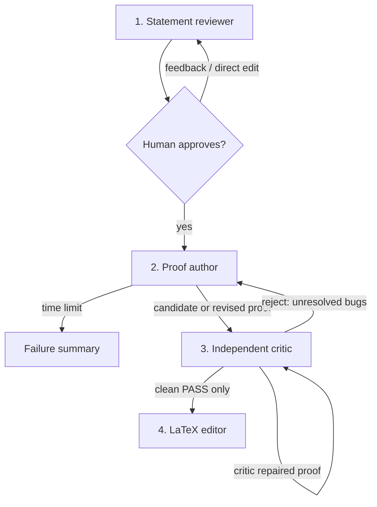

# TCS Prover

A local web UI that turns an informal theoretical-computer-science problem into
a checked statement, runs a persistent Codex proof search, independently audits
and repairs the candidate, then produces clean LaTeX.

## Install and run

Requires Python 3.9+, Node.js/npm, and a Codex account with access to the models
configured in the UI.

```bash
npm install -g @openai/codex
codex login
git clone https://github.com/yonggangjiang/tcs-prover.git
cd tcs-prover
python3 web_ui.py
```

On macOS, `Start TCS Prover.command` is an alternative launcher. Codex can use
an eligible ChatGPT plan; see OpenAI's
[Codex CLI guide](https://help.openai.com/en/articles/11096431) and
[ChatGPT-plan guide](https://help.openai.com/en/articles/11369540).

Enter a rough problem, review or edit the precise statement, and approve it.
**Advanced** controls each node's model, reasoning effort, prompt, author time
limit, and critic-round limit. Jobs run in parallel. **Show details** displays
the exact application prompts and returned model text. Private records and
outputs are stored under `runs/`, which Git ignores.

## Workflow



### 1. Statement reviewer

This node lets the user start with convenient informal language while preventing
a model from silently solving a different problem. It makes quantifiers,
encodings, promises, parameters, and community conventions explicit, then asks
for human approval.

For example, graph-algorithm papers commonly write a bound such as
`m log² n`. A literal model may object that `m` can be smaller than `n` and call
the target impossible, while the intended convention may exclude isolated
vertices, concern a reachable subgraph, or suppress an input-reading term. The
review step states the intended convention instead of letting that mismatch
derail the proof search.

### 2. Proof author

The author uses the durable-state, multi-agent prompt adapted from
[Chao Xu's “AI Agents for the Working Mathematician”](https://chaoxu.prof/posts/2026-07-18-ai-agents-for-the-working-mathematician.html).
Thanks to Chao Xu for publishing it. His prompt in turn credits OpenAI's
[Cycle Double Cover prompt](https://cdn.openai.com/pdf/04d1d1e4-bc75-476a-97cf-49055cd98d31/cdc_prompt.pdf)
and [Danus](https://github.com/frenzymath/Danus).

There is not yet controlled evidence that this prompt is better than the CDC
prompt. Chao reports a personal case where a long agent run succeeded after
one-shot ChatGPT attempts did not; this is useful evidence, not a benchmark.
TCS Prover keeps the Goal active: a blocked or prematurely ended author turn is
continued until it returns a solution or reaches the user-set time limit.

### 3. Independent critic

Instructions inside the author prompt do not guarantee that the resulting proof
survives a fresh check. The critic therefore collects three fresh hostile
audits, repairs every issue it can, and sends repaired mathematics to another
fresh critic. Unresolved bugs go back to the author. Only a clean pass exits the
loop. This catches both structural gaps and the small errors that accumulate in
long proofs.

“Independent” here means fresh contexts and subagents; same-family models may
still share blind spots. A human or different-family review remains advisable.

### 4. LaTeX editor

Correct-looking generated proofs are often repetitive, poorly ordered, or hard
to read. After—and only after—a clean critic pass, this node preserves the
mathematics while rewriting it as a compact, structured TCS-style LaTeX proof.
In practice this often makes a candidate substantially easier to inspect.

## Development

```bash
python3 -m unittest discover -s tests -q
```

The proof output is not a formal certificate. Review important results
independently. Source code is MIT-licensed; the adapted author prompt has the
separate attribution described in [LICENSE](LICENSE).
