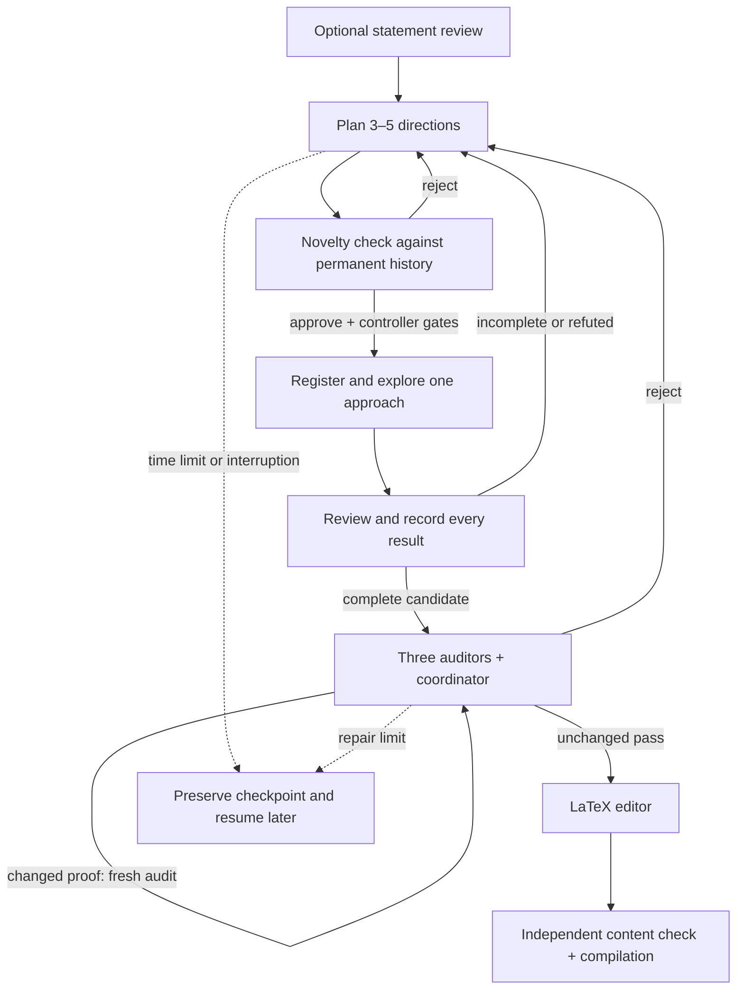

# TCS Prover

A local web UI that turns a theoretical-computer-science statement into recorded
research rounds: propose diverse approaches, check them against earlier work,
register one approach, explore it, and independently review the result. Complete
candidates receive three independent audits and a coordinating critic before
LaTeX editing and final verification. Algorithmic tasks can be entered as statements too.

For a concrete explanation without coding knowledge, follow the
[manual worker guide](docs/manual_workflow.md). It gives the exact prompts, their
order, the files to maintain, and the decisions to make with a basic LLM and a laptop.

The Codex CLI is the local model-call runtime. Persistent research state belongs
to the controller and its permanent archive, rather than one long conversation.
Astra with Ultra reasoning and Fast generation are the defaults for every
role. DeepSeek V4 Pro is an additional
model option that uses the same harness pipeline through DeepSeek's official
API.


## Install and run

Requires Python 3.9+ and the Codex CLI. Install Codex CLI through this
[official website](https://learn.chatgpt.com/docs/codex/cli).

```bash
codex login
git clone https://github.com/yonggangjiang/tcs-prover.git
cd tcs-prover
python3 -m pip install -r requirements.txt
python3 web_ui.py
```

The Web UI opens locally with Astra, Ultra, and Fast defaults for
the reviewer, proof author, critic, and LaTeX writer. The DeepSeek setup below
is needed only when you select DeepSeek for one or more roles.

## How to use DeepSeek

### 1. Obtain an official API key

Create a key in your DeepSeek account. TCS Prover uses only
`DEEPSEEK_API_KEY`; the key must belong to the official DeepSeek API account
that will be billed for the model calls.

### 2. Make the key available to TCS Prover

In the same Terminal window where you will start the Web UI, run:

```bash
export DEEPSEEK_API_KEY="sk-..."
```

This lasts for the lifetime of that shell. Editing or updating TCS Prover does
not erase the variable, so restarting from the same Terminal does not require
another `export`. A newly opened Terminal does require it unless you add the
same export to your shell startup configuration.

To check the variable without printing the secret:

```bash
python3 -c 'import os; print("DeepSeek key is set" if os.environ.get("DEEPSEEK_API_KEY") else "DeepSeek key is missing")'
```

### 3. Start the Web UI

From the repository directory:

```bash
python3 web_ui.py
```

Open **Advanced**, then select **DeepSeek V4 Pro — Official API** for any roles
you want DeepSeek to handle. Selecting it for all four model roles means that
the statement reviewer, author, three independent critic audits and
coordinator, and LaTeX writer all use DeepSeek. A Codex/ChatGPT login is not
required for roles that use DeepSeek.

DeepSeek exposes `high` and `max` reasoning in this harness. The shared menu is
normalized as follows: `low`, `medium`, and `high` run as DeepSeek `high`;
`xhigh`, `max`, and `ultra` run as DeepSeek `max`. DeepSeek always uses Standard
speed because the Fast service tier is specific to OpenAI models.

The harness passes the selected key through environment-backed authentication
to each relevant child process, injects an isolated
Responses-provider configuration, and loads model metadata based on DeepSeek's
[official Codex integration](https://api-docs.deepseek.com/quick_start/agent_integrations/codex/).
It does not put the key in process arguments, edit `~/.codex/config.toml`, send
the key through the UI, or save it in run artifacts.

If the UI reports that `DEEPSEEK_API_KEY` is missing, stop the Web UI, export
the key in the Terminal that will launch it, and start it again. If DeepSeek
returns an authentication error, verify that this is an active official API
key and that no extra quotation marks were copied into its value.

You can type your open problem into the text box and click “Check Statement.” The system will first revise the statement to remove ambiguities and handle corner cases, then ask you to approve or reject the revised version.

If you approve it, persistent reasoning will begin and continue until a solution
is found or the time limit is reached. The candidate passes through an
independent critic loop. Accepted proofs are then pruned into readable LaTeX.

Options for changing the default model, time limit, and other settings are under
**Advanced**. Astra (`gpt-6-astra`) is the default model for every node.

## Terminal runs from Markdown

On a server without a browser, put the complete statement in any UTF-8 Markdown
file. Paragraphs, quotes, mathematical backslashes, and line breaks can be
copied into the file without escaping. Then pass the file directly to
`web_ui.py`:

```bash
python3 web_ui.py statement.md
```

This sends the entire file directly to the proof author, exactly like enabling
**Skip statement review** in Statement mode. It does not start an HTTP server or
open a browser. With no command-line overrides, it uses the same defaults as the
web UI: 2 critic rounds, a 168-hour total workflow limit, Astra and Ultra for all proof
roles, the built-in role prompts, and Fast generation speed. The
activity log requests concise public reasoning summaries by default.

### Optional settings

Put overrides after the file or folder. The requested single-dash spelling,
double-dash camelCase spelling, and conventional double-dash kebab-case spelling
are all accepted. For example:

```bash
python3 web_ui.py statement.md -criticRounds 6 -thinkingHours 36
python3 web_ui.py statement.md --author-model gpt-5.6-terra --speed-mode standard
```

| Option | Default | Meaning |
| --- | --- | --- |
| `-criticRounds N` | `2` | At N consecutive repaired rounds, save **verification incomplete**; `1` to `100`. Every changed proof needs a fresh audit. A clean unchanged pass accepts; rejection resets the count. |
| `-thinkingHours HOURS` | `168` | Total elapsed-workflow limit; greater than `0` and at most `168`. Bounds research, critic, and final model calls. Completed work and the next step are retained when time runs out. |
| `-authorModel MODEL` | `gpt-6-astra` | Author model: `gpt-6-astra`, `gpt-5.6-sol`, `gpt-5.6-terra`, `gpt-5.6-luna`, or official `deepseek-v4-pro`. |
| `-criticModel MODEL` | `gpt-6-astra` | Critic model; same choices as the author. |
| `-writerModel MODEL` | `gpt-6-astra` | LaTeX writer model; same choices as the author. |
| `-reasoningEffort LEVEL` | `ultra` | Fallback effort for all three roles: `low`, `medium`, `high`, `xhigh`, `max`, or `ultra`. |
| `-authorEffort LEVEL` | shared effort | Override only the author effort. |
| `-criticEffort LEVEL` | shared effort | Override only the critic effort. |
| `-writerEffort LEVEL` | shared effort | Override only the LaTeX writer effort. |
| `-speedMode MODE` | `fast` | `standard` for normal speed or `fast` for ChatGPT's accelerated generation. DeepSeek calls always use standard service because Fast is provider-specific. |
| `-reasoningSummary LEVEL` | `concise` | Public activity-log summaries: `none`, `concise`, or `detailed`. This never exposes private chain-of-thought. |
| `-authorPromptFile PATH` | built-in prompt | Load a UTF-8 author prompt; it must contain exactly one `[STATEMENT]`. |
| `-criticPromptFile PATH` | built-in prompt | Load a UTF-8 critic prompt. |
| `-finalPromptFile PATH` | built-in prompt | Load a UTF-8 LaTeX prompt. |

Prompt-file paths are resolved from the terminal's current working directory.
Run `python3 web_ui.py --help` to see every spelling and allowed value.

## How to use checkpoints

TCS Prover writes durable artifacts while a job progresses. When the Web UI is
started again, it scans `runs/*/transcript.jsonl`, restores the historical job
cards, and lists every resumable critic checkpoint found in those run folders.
You do not need to keep the old browser tab open.

The home-page checkpoint buttons have exact stage semantics:

| Checkpoint shown | What is already saved | What continuation runs |
| --- | --- | --- |
| **Saved proof candidate** | Checked statement and complete proof | Starts a fresh three-auditor critic review; later audit files are intentionally not reused when this earlier checkpoint is selected. |
| **Independent audits 1/3** or **2/3** | Candidate plus the displayed completed reports | Restores those reports and runs only the missing auditors. |
| **Independent audits 3/3** | Candidate plus all three reports | Skips all auditors and starts coordinator adjudication. |
| **Critic coordinator — failed/interrupted** | Candidate and all three reports | Retries only the coordinator. |

To continue from the Web UI:

1. Stop the old server if it is still running, then run `python3 web_ui.py`.
2. On the home screen, locate the historical job by its full start/finish time.
3. Click the continuation button beside the checkpoint you want.
4. Confirm the action. TCS Prover creates a new job and opens it immediately.

The source run is never overwritten. The new job copies the selected candidate,
compatible audit checkpoint, role prompts, model choices, reasoning efforts,
speed, critic-round limit, and workflow time limit. Old saved model routes that
are no longer selectable are migrated to the official DeepSeek model when the
job is restored.

Audit reuse requires a matching proof, model, effort, instructions, and audit
focus assignment; restored reports must satisfy the current response schema;
an incompatible audit file is ignored while the earlier proof-candidate
checkpoint remains available. Very old runs that predate `job-settings.json`
can restore only choices visible in their transcript. A role that never ran has
no recorded model choice and therefore uses the current default when resumed.
The continuation confirmation names these unknown legacy roles before a new
paid request starts.

A checkpoint exists only after a complete artifact has been written. It cannot
restore the middle of an in-flight model response or its private reasoning. If
a process stops between two checkpoints, continuation begins from the most
recent checkpoint listed on the job card.

### Continue a manually stopped job

Jobs stopped with the Web UI's **Stop** button remain visible as **Stopped at
review**, **solve**, **repair**, **critic**, **final**, or **failure** after the
server is restarted. On the home page, use the stage-specific continuation
button:

| Stopped stage | Button | Continuation boundary |
| --- | --- | --- |
| Statement review | **Retry statement review** | Starts a new review request from `review-input.json`, including the current statement and feedback, plus the saved prompt and role settings. Older runs without this artifact warn that only their original draft and no feedback can be recovered. |
| Proof author, repair, or interrupted failure summary | **Continue proof author** | Restores the exact statement, complete research archive, pending research step, historical notebooks, and saved user instructions. It does not treat visible partial text as a complete proof. A stopped repair originating from critic-resume safely re-enters its critic checkpoint instead. |
| Critic | **Continue critic** | Restores the latest compatible proof and paid independent-audit checkpoint, so completed audits are not repeated. |
| LaTeX editor | **Retry LaTeX editor** | Restores `final-input.json` and runs editing, independent content-preservation review, and local compilation when available. LaTeX-only jobs reuse `latex-input.md`. Older jobs without an exact final input safely fall back to their latest critic checkpoint. |

Every action creates a new run folder and leaves the stopped source run
unchanged. An interrupted provider request, model context, subagent process, or
private reasoning cannot be resumed. Review and final requests therefore retry
from their exact saved public input, while research continuation uses the complete
controller-maintained archive and saved next step. Historical runs created before
`manual-stop.json` are recognized from their existing `Stop requested`
transcript entry.

### Command-line fallback

Resume persistent research from its last completed step with a new time budget:

```bash
python3 web_ui.py --resume-research runs/YOUR_PREVIOUS_RUN
python3 web_ui.py --resume-research runs/YOUR_PREVIOUS_RUN --thinking-hours 24
```

This opens a continued browser-visible job. The source run is unchanged. The
new run carries the complete SQLite archive and readable notebooks; saved
settings remain in effect unless explicitly overridden. All continuation
paths, including critic and final checkpoints, preserve the research history.
Old `FAILED.md`, `PROVED.md`, `REGISTRY.md`, and legacy memory files are retained
and imported as historical evidence. Prompt updates do not discard history;
an archive for a different exact statement is rejected rather than overwritten.

If a run contains `SOLUTION.md` or `saved-candidate.md` but no checkpoint button
is available, open a new critic job explicitly:

```bash
python3 web_ui.py --resume-critic runs/2026-08-26_16-33-26_example
```

This loads the saved complete proof, checked statement, audit checkpoint when
present, and role prompts into a new browser-visible job. A clean critic pass
continues to the LaTeX editor. A critic rejection returns the exact candidate
and bug report to the normal proof-author repair loop; the harness workflow is
not shortened or replaced.

## Parallel folder runs

Passing a folder starts an independent proof for every top-level `.md` file in
that folder:

```bash
python3 web_ui.py statements/
python3 web_ui.py statements/ -criticRounds 6 -authorEffort max
```

The lookup is case-insensitive (`.md` and `.MD` both work), deterministic, and
non-recursive. All matching files and shared settings are validated before any
job starts. The jobs then run concurrently, and every override applies to every
file. Be aware that a large folder can therefore use many simultaneous Codex
jobs and credits.

Terminal output is concise by default: it reports only the current workflow
step, diagnostics, errors, and the start/finish result for each input file.
Prompts, model events, reasoning summaries, tool activity, and proof bodies are
not printed. They remain available in each proof's complete `transcript.jsonl`
and other artifacts under its separate directory in `runs/`. Pass
`--verbose-events` to restore the full public JSONL event stream; folder events
then include an `inputFile` field. A failed job does not cancel its siblings.
The exit status is `0` when every proof succeeds, `1` for invalid input or any
failed proof, and `130` after Ctrl-C. Ctrl-C stops all active folder jobs and
their subprocess trees.

## Read a transcript as a human narrative

`transcript.jsonl` is the complete machine-readable event log and is deliberately
verbose. The local browser viewer organizes workflow stages, public reasoning
summaries, model messages, subagent/tool activity, critic checks, and final or
failure results without app-server protocol noise:

```bash
python3 transcript/view_transcript.py runs/2026-08-03_16-20-24_example/
python3 transcript/view_transcript.py runs/2026-08-03_16-20-24_example/transcript.jsonl
python3 transcript/view_transcript.py                       # newest run
```

The UI provides stage and activity filters, full-text search, root-only and
compact views, expandable long entries, critic verdict cards, automatic
full-file loading with pause/resume, and live updates. It binds only to local
host and protects its local API with a random per-launch token.

For terminal or file output, use the text mode:

```bash
python3 transcript/view_transcript.py RUN --text
python3 transcript/view_transcript.py RUN --text --follow
python3 transcript/view_transcript.py RUN --output readable.txt
```

In text mode, prompt bodies are hidden by default because they are long; add
`--prompts` to show them. Use `--stage solve`, `--stage critic`, `--root-only`,
`--no-tools`, or `--max-text 0` to adjust the view. Run
`python3 transcript/view_transcript.py --help` for all options. Both views display the
public reasoning summaries retained by TCS Prover, not private chain-of-thought.
They read incrementally, so even very large transcripts do not need to fit in
memory.

Choose **Statement** to review or edit a rough problem before approval. Include
the computational model, problem description, and asymptotic goal in the
statement for algorithmic tasks. Choose **LaTeX polish** to edit an existing
theorem and proof using the editor, independent final verifier, and compilation check.
**Advanced** controls each node's model, reasoning effort, prompt, public activity-log
detail, workflow time limit, and critic-round limit. The log can show status
only or request concise or detailed model-generated summaries. Its **Statement review only** option runs just the
reviewer, saves the checked statement and reviewer notes, and finishes without
starting the proof author, critic, or LaTeX editor. This option and **Skip
statement review** are mutually exclusive. Jobs run in parallel. **Show
details** displays the exact application prompts and returned model text.
Private records and outputs are stored under `runs/`.

Every job card shows its full local start and finish date and time, including
seconds. Active jobs show that they have not finished yet, so repeated problem
titles remain distinguishable.

While a proof author or author repair is running, **Guide the running proof
author** records a live instruction for the next research step. It does not
discard the active archive or restart the research project. Research rounds
already use explicit arguments without shell, web, or subagent tools. The
control is intentionally unavailable during statement review,
critic audits, failure summaries, and final LaTeX editing.

## Workflow



### 1. Statement reviewer

This node lets the user start with convenient informal language while preventing
a model from silently solving a different problem. To use it without requesting
a proof, open **Advanced**, enable **Statement review only**, and submit the
statement. The completed result remains available to copy from the review page
and is saved as `checked-statement.md` in that job's run directory. Only the
reviewer model, reviewer reasoning effort, reviewer prompt, and generation speed
apply in this mode.

For example, graph-algorithm papers commonly write a bound such as
`m log² n`. A literal model may object that `m` can be smaller than `n` and call
the target impossible. The review step states the intended convention and writes
it as `(m+n) log² n` instead of letting that mismatch
derail the proof search.

### 2. Persistent research rounds

The default author node uses `run: research`. It makes separate structured
calls for planning, novelty assessment, one registered exploration, and an
independent result review. The planner supplies three to five proposals. Before
assignment the controller searches earlier records, asks a fresh assessor to
compare mechanisms and obstacles, blocks previously assigned identical
mechanisms, and excludes the two most recently assigned families. A reopening
requires existing record IDs and concrete new evidence; a changed mechanism is
still required.

Every exploration returns a full result card, even when it is incomplete.
The next reviewer records exactly what failed, the evidence, the condition for
reopening, and any reusable partial result with its assumptions. Missing
arguments, refuted subclaims, and interrupted requests have different meanings.
A reviewed full candidate enters the critic; other results inform the next
portfolio. Research calls have no shell, web, or subagent tools, so recorded
claims must be supported by explicit arguments rather than invented experiments.

`research.sqlite3` permanently stores complete public prompts, raw responses,
research cards, candidate text, reviews, decisions, and checkpoints. Events are
append-only. SQLite transactions commit a result and its next-step checkpoint
together. Completed responses are cached for recovery. Disk errors stop further
work; they do not silently discard research. The exact statement identifies the
archive; changed prompts/settings become new recorded versions.

Readable views live under `research/`:

| Artifact | Contents |
| --- | --- |
| `STATEMENT.md` | Exact original task. |
| `records/eNNNNNN.md` | Complete readable event cards, retained permanently. |
| `INDEX.md` | Recent navigation and counts; older cards remain available. |
| `STATE.md` | Current workbench, open issues, recent families, and saved next step; large caches are summarized. |
| `FAILED.md` | Rejected, failed, and unfinished work, distinguished by status. |
| `PROVED.md` | Reviewed results and candidate arguments with their review status; not a blanket claim of formal proof. |

Only model briefings and navigation indexes are shortened. The full archive is
never pruned. Models can search the entire relevant history or request a
record by ID in successive 16,000-character sections. Reopening repairs missing
Markdown exports from SQLite. Continuation copies the database consistently and
regenerates readable views without changing the source run.

The shared workflow deadline bounds research, critic, and final model calls.
When a time/repair limit or a repeated request failure stops progress, the next
step remains saved. `--resume-research` starts a continued job with a new budget.
This is resumable research, not an indefinitely running background service.

The program enforces registration, exact repeats, and recent-family rotation.
The novelty assessor's comparison of differently worded ideas remains a model
judgment and can be wrong. These checks reduce repeated dead ends; they do not
guarantee semantic novelty or a useful discovery on every round.

### 3. Independent critic

Three fresh auditor calls receive the same complete statement and candidate,
with separate focuses: detailed correctness, implementability/resource costs,
and hostile counterexamples. The coordinator receives their actual reports
and tries to repair valid bugs. Every completed auditor report is checkpointed
immediately; compatible continuation reuses completed reports.

The controller compares returned candidate text rather than trusting the
critic's `fixed` flag. A changed proof requires another fresh three-auditor
round. Reaching the consecutive repaired-round limit (default 2) saves
**verification incomplete** instead of accepting an unchecked repair. A
rejection returns its exact bugs and safely repaired candidate to research.

Open obligations have stable IDs. They persist until the critic resolves each
supplied ID with explicit evidence. Silence about an issue does not clear it,
and a pass with outstanding obligations becomes a rejection. Acceptance
requires an unchanged pass with the three actual audits passing and no
remaining bugs or obligations. Model review is not formal proof verification.

### 4. LaTeX editing and final verification

The editor preserves the exact accepted input, produces `formatted-candidate.tex`,
and sends it to a separate content verifier. That verifier compares the
original argument and final document, including any expanded explanation. It
does not repair the document. Rejection preserves both versions and the reasons;
resumed finalization retries the editor with the original input and saved feedback.

After a content pass, local `pdflatex` compilation runs when installed, with
shell execution disabled, restricted file access, and a 30-second timeout.
`final-validation/` retains the exact source, compiler log, and any resulting
PDF. Compilation failure remains incomplete. If the compiler is unavailable,
the LaTeX document can still be delivered with that limitation stated explicitly.
LaTeX-only polishing uses the same preservation and final checks.

## Project structure

The root has two Python entry points. `workflow_runner.py` provides the graph
engine and model transport; `persistent_research.py` manages research rounds,
and `research_journal.py` owns the permanent archive. `web_ui.py` launches the UI or Markdown proof jobs. The
`workflows/` directory contains exactly two YAML definitions:

```text
workflow_runner.py          Graph engine, model transport, and workflow CLI
persistent_research.py      Registered research rounds and novelty gates
research_journal.py         Durable SQLite archive and readable notebooks
latex_verification.py       Restricted local document compilation
web_ui.py                   UI and Markdown-job launcher
workflows/
  author_critic.yaml         Author/critic prompts, response schema, and logic
  clean_up.yaml              LaTeX prompts, response schema, and logic
transcript/
  view_transcript.py         Transcript reader, CLI, and viewer server
  transcript_ui/            Transcript viewer HTML, JavaScript, and CSS
ui/
  server.py                 HTTP endpoints, job state, and process management
  review.py                 Independent statement-review procedure
  cli.py                    UI startup and Markdown file/folder runs
  index.html, app.js, styles.css
workflows/workflows.md      Workflow authoring guide and full YAML reference
docs/manual_workflow.md     Exact prompts and step-by-step worker procedure
docs/render_manual.py       Regenerate/check the manual against current YAML
tests/                      Offline regression tests
```

The UI starts the root workflow runner in each job's private workspace and
passes it the appropriate YAML files. Statement review remains independent of
the workflow graphs. UI and Markdown-job artifacts still live under the
repository's `runs/` folder, regardless of the launcher's working directory.

## Workflow files and executor

Each YAML file contains `nodes` and `prompts`. Node names are arbitrary; the
first node is the entry point. `run: structured` makes a model call with a
response shape, `run: research` operates the durable research cycle, and the
legacy `run: goal` remains available for custom persistent-thread workflows. The YAML
defines inputs, result checks, state updates, and transitions, including the
critic's repeat limit.

A complete custom workflow can be as small as this `summarize.yaml`:

```yaml
nodes:
  summarize:
    run: structured
    prompt: summarize
    inputs:
      content: state.input
    response:
      summary: string
    after:
      - set: {output: result.summary}
    next: end
prompts:
  summarize: "Summarize this text in one sentence: {content}"
```

```bash
python3 workflow_runner.py summarize.yaml < notes.md
```

The [workflow authoring guide](workflows/workflows.md) explains every YAML entry,
response shorthand and full schemas, branching and repeat limits, expressions,
persistent-session prompts, model overrides, and offline validation. It includes
a complete editing workflow with decisions and a configurable repeat limit.
Keep custom definitions outside the bundled `workflows/` directory.

Run the graphs directly with UTF-8 input on standard input:

```bash
python3 workflow_runner.py workflows/author_critic.yaml workflows/clean_up.yaml < statement.md
python3 workflow_runner.py workflows/clean_up.yaml < theorem-and-proof.md
```

The first command runs proof search, criticism, and LaTeX cleanup; the second
runs cleanup alone. Both skip statement review. Use
`python3 workflow_runner.py --help` for model, reasoning, time-limit, critic-round,
and prompt overrides. `--model` sets the fallback model for any workflow;
`--set NAME=VALUE` supplies arbitrary named options and accepts JSON values.
Node `role` settings can use options such as `editor_model` and `editor_effort`.

The CLI initializes `state.input`, `state.statement`, and `state.source` with the
same input after trimming surrounding whitespace. Chained graphs share state,
and `state.failed` stops the chain. Output is JSONL events, ending with
`workflow_result` on success and its
`output` field from `state.output`. The Python API is
`execute(path, state, options=...)` or `execute_workflows(paths, state, options)`.
All graphs are validated before a chain starts. `requirements.txt` installs
PyYAML for loading definitions and jsonschema for checking response schemas.

Run the regression suite without making model calls:

```bash
python3 -m unittest discover -s tests -v
```
