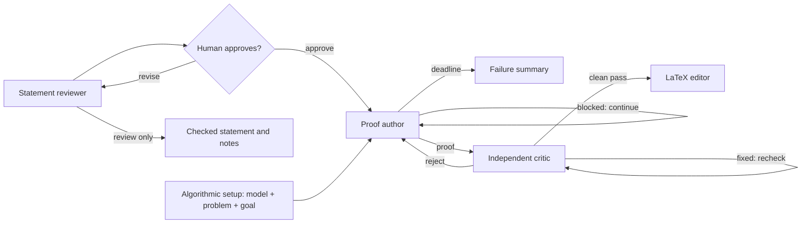

# TCS Prover

A local web UI that turns either an informal theoretical-computer-science
statement or a structured algorithmic problem into a persistent Codex proof
search, independently audits and repairs the candidate, then produces clean
LaTeX.


## Install and run

Requires Python 3.9+, and a Codex account with access to the models
configured in the UI. Please install Codex CLI through this [official website](https://learn.chatgpt.com/docs/codex/cli).

```bash
codex login
git clone https://github.com/yonggangjiang/tcs-prover.git
cd tcs-prover
python3 web_ui.py
```

You can type your open problem into the text box and click “Check Statement.” The system will first revise the statement to remove ambiguities and handle corner cases, then ask you to approve or reject the revised version.

If you approve it, persistent reasoning will begin and continue until the time limit you set. The generated answer will then pass through a strict correctness-checking loop designed to catch errors. Finally, the output TeX file will be pruned for readability and returned as the final result.

### Terminal runs from Markdown

On a server without a browser, put the complete statement in any UTF-8 Markdown
file. Paragraphs, quotes, mathematical backslashes, and line breaks can be
copied into the file without escaping. Then pass the file directly to
`web_ui.py`:

```bash
python3 web_ui.py statement.md
```

This sends the entire file directly to the proof author, exactly like enabling
**Skip statement review** in Statement mode. It does not start an HTTP server or
open a browser. With no command-line overrides, it uses the same defaults as the
web UI: 4 critic rounds, a 168-hour total workflow limit, Sol and Ultra for all proof
roles, the built-in role prompts, and Fast generation speed.

#### Optional settings

Put overrides after the file or folder. The requested single-dash spelling,
double-dash camelCase spelling, and conventional double-dash kebab-case spelling
are all accepted. For example:

```bash
python3 web_ui.py statement.md -criticRounds 6 -thinkingHours 36
python3 web_ui.py statement.md --author-model gpt-5.6-terra --speed-mode standard
```

| Option | Default | Meaning |
| --- | --- | --- |
| `-criticRounds N` | `4` | Critic rounds per author proof; `1` to `100`. |
| `-thinkingHours HOURS` | `168` | Total elapsed-workflow limit; greater than `0` and at most `168`. It interrupts an active author, but not an active critic or the final LaTeX editor. |
| `-authorModel MODEL` | `gpt-5.6-sol` | Author model: `gpt-5.6-sol`, `gpt-5.6-terra`, or `gpt-5.6-luna`. |
| `-criticModel MODEL` | `gpt-5.6-sol` | Critic model: `gpt-5.6-sol`, `gpt-5.6-terra`, or `gpt-5.6-luna`. |
| `-writerModel MODEL` | `gpt-5.6-sol` | LaTeX writer model: `gpt-5.6-sol`, `gpt-5.6-terra`, or `gpt-5.6-luna`. |
| `-reasoningEffort LEVEL` | `ultra` | Fallback effort for all three roles: `low`, `medium`, `high`, `xhigh`, `max`, or `ultra`. |
| `-authorEffort LEVEL` | shared effort | Override only the author effort. |
| `-criticEffort LEVEL` | shared effort | Override only the critic effort. |
| `-writerEffort LEVEL` | shared effort | Override only the LaTeX writer effort. |
| `-speedMode MODE` | `fast` | `fast` for 1.5x generation or `standard` for normal speed. Fast uses credits at a higher rate. |
| `-authorPromptFile PATH` | built-in prompt | Load a UTF-8 author prompt; it must contain exactly one `[STATEMENT]`. |
| `-criticPromptFile PATH` | built-in prompt | Load a UTF-8 critic prompt. |
| `-finalPromptFile PATH` | built-in prompt | Load a UTF-8 LaTeX prompt. |

Prompt-file paths are resolved from the terminal's current working directory.
Run `python3 web_ui.py --help` to see every spelling and allowed value.

#### Parallel folder runs

Passing a folder starts an independent proof for every top-level `.md` file in
that folder:

```bash
python3 web_ui.py statements/
python3 web_ui.py statements/ -criticRounds 6 -authorEffort max
```

The lookup is case-insensitive (`.md` and `.MD` both work), deterministic, and
non-recursive. All matching files and shared settings are validated before any
job starts. The jobs then run concurrently, and every override applies to every
file. Be aware that a large folder can therefore use many simultaneous Codex
jobs and credits.

Terminal output is concise by default: it reports only the current workflow
step, diagnostics, errors, and the start/finish result for each input file.
Prompts, model events, reasoning summaries, tool activity, and proof bodies are
not printed. They remain available in each proof's complete `transcript.jsonl`
and other artifacts under its separate directory in `runs/`. Pass
`--verbose-events` to restore the full public JSONL event stream; folder events
then include an `inputFile` field. A failed job does not cancel its siblings.
The exit status is `0` when every proof succeeds, `1` for invalid input or any
failed proof, and `130` after Ctrl-C. Ctrl-C stops all active folder jobs and
their subprocess trees.

#### Read a transcript as a human narrative

`transcript.jsonl` is the complete machine-readable event log and is deliberately
verbose. The local browser viewer organizes workflow stages, public reasoning
summaries, model messages, subagent/tool activity, critic checks, and final or
failure results without app-server protocol noise:

```bash
python3 view_transcript.py runs/2026-08-03_16-20-24_example/
python3 view_transcript.py runs/2026-08-03_16-20-24_example/transcript.jsonl
python3 view_transcript.py                                 # newest run
```

The UI provides stage and activity filters, full-text search, root-only and
compact views, expandable long entries, critic verdict cards, automatic
full-file loading with pause/resume, and live updates. It binds only to local
host and protects its local API with a random per-launch token.

For terminal or file output, use the text mode:

```bash
python3 view_transcript.py RUN --text
python3 view_transcript.py RUN --text --follow
python3 view_transcript.py RUN --output readable.txt
```

In text mode, prompt bodies are hidden by default because they are long; add
`--prompts` to show them. Use `--stage solve`, `--stage critic`, `--root-only`,
`--no-tools`, or `--max-text 0` to adjust the view. Run
`python3 view_transcript.py --help` for all options. Both views display the
public reasoning summaries retained by TCS Prover, not private chain-of-thought.
They read incrementally, so even very large transcripts do not need to fit in
memory.

Choose **Statement** to review or edit a rough problem before approval. Choose
**Algorithmic** to specify the model of computation, problem description, and
asymptotic upper- or lower-bound goal; these fields go directly to the proof
author without a statement-review step.
**Advanced** controls each node's model, reasoning effort, prompt, workflow time
limit, and critic-round limit. Its **Statement review only** option runs just the
reviewer, saves the checked statement and reviewer notes, and finishes without
starting the proof author, critic, or LaTeX editor. This option and **Skip
statement review** are mutually exclusive. Jobs run in parallel. **Show
details** displays the exact application prompts and returned model text.
Private records and outputs are stored under `runs/`.

## Workflow



### 1. Statement reviewer

This node lets the user start with convenient informal language while preventing
a model from silently solving a different problem. To use it without requesting
a proof, open **Advanced**, enable **Statement review only**, and submit the
statement. The completed result remains available to copy from the review page
and is saved as `checked-statement.md` in that job's run directory. Only the
reviewer model, reviewer reasoning effort, reviewer prompt, and generation speed
apply in this mode.

For example, graph-algorithm papers commonly write a bound such as
`m log² n`. A literal model may object that `m` can be smaller than `n` and call
the target impossible. The review step states the intended convention and write it as `(m+n) log² n`instead of letting that mismatch
derail the proof search.

### Algorithmic mode

This mode skips the statement reviewer. The server trims and combines the three
required fields under explicit `MODEL OF COMPUTATION`, `PROBLEM DESCRIPTION`,
and `GOAL (ASYMPTOTIC UPPER OR LOWER BOUND)` headings, saves both the source
fields and the combined task in the run folder, and sends that exact task through
the normal proof-author pipeline.

The model and problem fields also show reusable presets loaded from
`algorithmic/model.json` and `algorithmic/problem.json`. Each catalog entry has
only a `name` and `description`; selecting its name copies the description into
the corresponding field. Restart the local server after editing a catalog.

### 2. Proof author

The author uses the durable-state, multi-agent prompt adapted from OpenAI's
[Cycle Double Cover prompt](https://cdn.openai.com/pdf/04d1d1e4-bc75-476a-97cf-49055cd98d31/cdc_prompt.pdf).

The author keeps the Goal active: a blocked or prematurely ended author turn is
continued until it returns a solution or reaches the user-set total elapsed-time
limit. The web limit uses the same clock displayed at the top of the page, so
statement review and approval time count too. If the limit expires during a
critic round, that critic work continues; a clean pass proceeds to LaTeX, while
a rejection goes to the failure-summary node instead of starting another author
revision.

Each proof run also owns two private controller-written files in its `runs/...`
directory. `author-anchor.md` contains the exact original author prompt and
statement. `author-memory.json` is a bounded ledger of candidate fingerprints,
approach outcomes, blocked routes, critic feedback, and unresolved obligations.
Writes are atomic and best-effort private. The JSON file is capped at 64 KiB,
and the historical snapshot placed in a model request is independently capped
at 24 KiB; old records are folded into counters and a rolling digest.

The controller re-injects the immutable anchor and current memory after every
root-author context compaction, every explicit continuation, and every critic
rejection. A compaction re-anchor is steered into the same active turn; it does
not replace the author thread. Memory records repeated candidates but does not
skip calls, end the search, or otherwise alter the proof workflow.

### 3. Independent critic

Although in the author prompt there are already instructions on indepent audit checking, there are cases where these instructions do not guarantee that the resulting proof
survives a fresh check. The critic therefore do the job again and repairs every issue it can, sends repaired mathematics to another
fresh critic. Unresolved bugs go back to the author. Only a clean pass exits the
loop. This catches both structural gaps and also fixable bugs.

“Independent” here means fresh contexts and subagents. A human or different-family review remains advisable.

### 4. LaTeX editor

Correct-looking generated proofs are often repetitive, poorly ordered, or hard
to read. After—and only after—a clean critic pass, this node preserves the
mathematics while rewriting it as a compact, structured TCS-style LaTeX proof.
In practice this often makes the output substantially easier to read.
